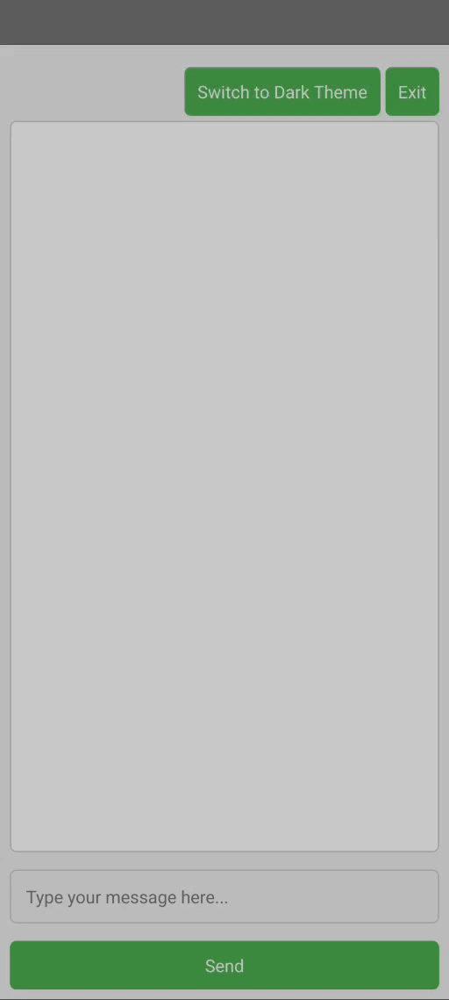

# Chatbot-GUI
---
[In Python](https://github.com/mdriyadkhan585/Chatbot-Python)

[In C Script](https://github.com/mdriyadkhan585/Chatbot-in-C)


---

Welcome to the Chatbot GUI project! This project is a simple yet functional chatbot application built with Python using PySide6 and Qt. It provides a user-friendly interface with theme-switching capabilities and basic chatbot interactions.

## Features ✨

- **Interactive Chatbot**: Engage in a conversation with the chatbot.
- **Theme Switching**: Toggle between light and dark themes.
- **Help Command**: Get instructions on how to use the chatbot.
- **Exit Functionality**: Close the application with a click of a button.
- **Dynamic Responses**: Receive replies based on predefined queries.

## Requirements 🛠️

- Python 3.x
- PySide6

## Installation 📦

1. **Clone the Repository**:
   ```bash
   git clone https://github.com/yourusername/Chatbot-GUI.git
   cd Chatbot-GUI
   ```

2. **Install Dependencies**:
   ```bash
   pip install PySide6
   ```

## Running the Application 🚀

1. **Save the Script**: Ensure you have the script saved as `chatbot.py`.

2. **Run the Script**:
   ```bash
   python chatbot.py
   ```

## How to Use 📝

- **Start a Conversation**: Type your message in the input box and press Enter or click the "Send" button.
- **Switch Themes**: Click the "Switch to Dark Theme" button (or "Switch to Light Theme" if already in dark mode) to change the theme.
- **Exit the Application**: Click the "Exit" button to close the application.
- **Get Help**: Type `help` and press Enter to see a list of available commands.

### Example Commands

- `hello` – Greet the chatbot.
- `how are you` – Ask how the chatbot is doing.
- `what's your name` – Find out the chatbot's name.
- `what can you do` – Learn about the chatbot's capabilities.
- `what's the time` – Get the current time.
- `what's the date` – Get today's date.
- `tell me a joke` – Hear a joke from the chatbot.
- `bye` – Exit the chat and close the application.
- `help` – Get a list of commands and usage instructions.

## GIF File 📸



## Contributing 🤝

Feel free to open issues or submit pull requests if you have suggestions or improvements. Your contributions are welcome!

## Contact 📫

For any questions or feedback, please reach out to [Email me](mailto:mdriyadkhan585@gmail.com).

---
